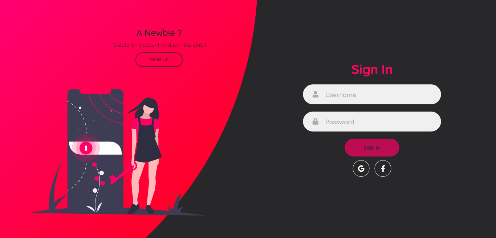

# Social Media Integration
This repository consists of HTML, CSS & JS code for a sign in / sign up page (front - end) along with social media integrations (Google & Facebook).

# Technologies
* Google OAuth
* Facebook OAuth
* Boostrap
* SVG Icons
* Vanilla Tilt Animation
* Font Awesome
* JQuery

# General Info
* No database is used.
* It focuses only on the social media integrations (Google & Facebook).
* Once the log in through Google / Facebook is successful, the web page displays the user details like name, email id, etc.
* The user can log out and sign in through another account.

# Project Link
https://barunipriyats.github.io/SocialMediaIntegration/

# Screenshots

